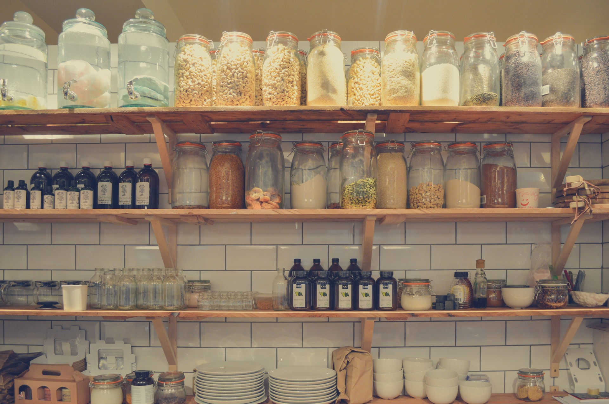
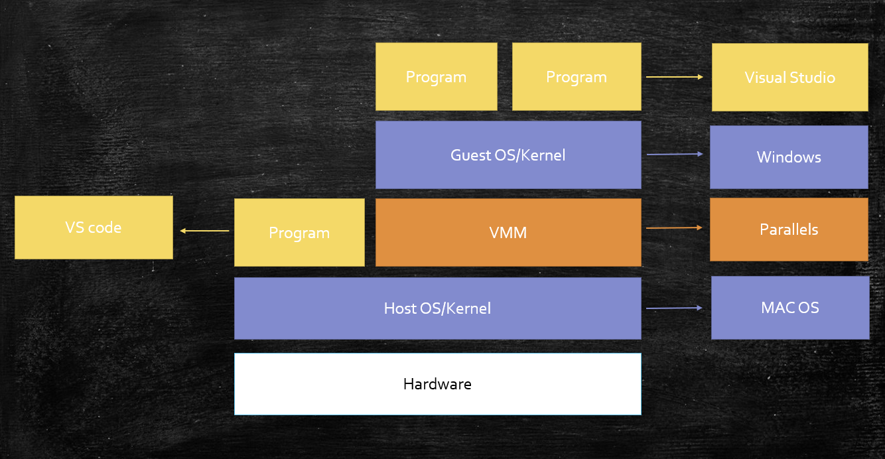
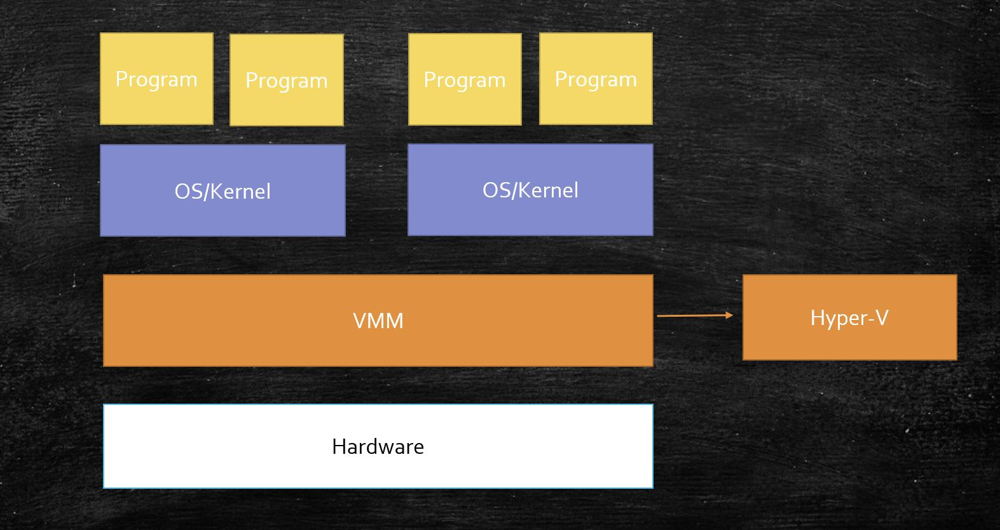
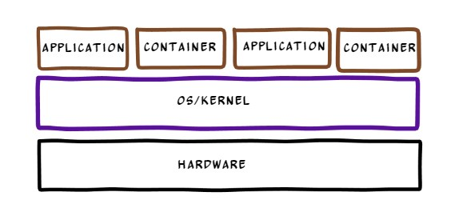

As a kid, one of the fascinating places for me in my home was the kitchen area, where I had restricted access - partly due to safety concerns and partly due to my irresistible desire to pocket the heavenly looking cookies and chocolates kept within glass jars, high enough for me to reach.

There is no free lunch - we had one rule at our home, which everyone obeyed. I would help my Mom cleaning up the glass jars and get a piece of chocolate with a pat on my back. More than that, I would get a chance to ask any absurd questions popping out of my nonsensical mind, and my Mom would decipher the answers with a beautiful smile. It was a bonus for me.

One certain day, while rubbing off the dust from jar lid, I asked, "Why do you keep all kitchen items in jars?."

"To keep them safe from you and your sister.", she answered with a broad smile. "No, to keep them safe from insects and moisture." She continued.
"Look, we have limited space in our kitchen. If we can keep the kitchen items organized, we don't face the trouble of finding them and waste anything." 

I nodded while trying to interpret the meaning of it.

"Look at this small jar. I keep all the spice packets, Cumin, Cinnamon Clove, and put a *spice label* on it. Whenever I need any spice, I would get a packet from it. Look at the bigger one. I keep flour in it and can't keep any other item in this jar. makes sense?" It started making sense to me, and I nodded again. 

"Well, this also helps me organizing the entire kitchen area. I keep all the jars close to the cooking area, which I need more often. That box of pasta you see, I keep near to the cooking area, since you and your sister always demand pasta during breakfast." I chuckled and admired my Mom for her skill.

I learned and inherited my organizational skills from my Mom.

A few years later, on a fine Sunday, we were excited and busy preparing to shift to a new house at a beautiful location, little away from the husty busty of the city. While my sister, dad, and I were scratching our head to pack all of our necessary items, my Mom declared - I'm done packing the kitchen items.

"You are the wonder woman or what?" My sister shouted out with surprise. "No, my dear. Since I always keep the kitchen items in boxes, all I had to do was to put them in one place. It is also going to help me set up my new kitchen very quickly. All I need to do is to place the boxes into the right rack".  As always, she smiled and turned back like a boss.

Fast forward to twenty years. I was tasked to build the next-generation platform to host our mission-critical services, and I have started learning about *Docker* and *Kubernetes*. When I first read about containers, I almost screamed - "Oh, gosh. Someone has stolen my Mom's idea.". I could relate to many concepts used in container technology from my previous experience.

----

## What are containers then?
In simple terms, a container is a basic unit of ***isolation*** for the execution of an application, process, or service. 

I understood this isolation is no different than the way my Mom used to keep kitchen items separate. But let's understand the true meaning of this in the context of software containers.

Processes within a single machine provide isolation but, to a limited extent. Physical separation (by adding more physical machines) was one definite way to achieve isolation when containers and VM were not present. When VM came into the picture, it changed the rule of the game. It was able to provide separation within a single physical boundary. But the original question (how do we achieve more isolation in process level?) was unanswered until the container entered into the picture.

## So, how does a container differ from a VM?
You might have heard that VM provides hardware virtualization, whereas the container provides operating system virtualization. You might have also heard that containers are lightweight, provides native performance, requires less memory than VM. 

To understand this, let's first understand how VM works.

Majorly you can see two types of VMs. **Hosted VM** (Type 2 VMM) and **Native VM** (Type 1 VMMs)
   
In both cases, a piece of software that plays a crucial role in managing and isolating resources is known as [VMM (Virtual Machine  Monitor)](https://en.wikipedia.org/wiki/Hypervisor).

**Hosted VM** - 
[Parallels](https://en.wikipedia.org/wiki/Parallels_Desktop_for_Mac) and [VirtualBox](https://en.wikipedia.org/wiki/VirtualBox) are of hosted VM type and very popular among consumers. For example, if you have Mac Book and you want to run Windows 10 on it, you can first install Parallels on your laptop and then run Windows 10 using Parallels.

**Native VM** - [Microsoft's Hyper-V](https://en.wikipedia.org/wiki/Hyper-V) and [XEN](https://en.wikipedia.org/wiki/Xen) are examples of native VM. Native VM directly runs on top of hardware and provides a way to resource abstraction and hence commonly referred as bare-metal VMM. These VMs are mostly used in servers and data centers.

**Container** - 
A container is nothing but an ***isolated process***(or you can say it's a *containerized process*). It runs directly on top of the host OS, just like another regular process. Since it's just like a regular process, you can see better performance, less memory consumption as compared to VM. But what makes it different from a regular process is its isolation. Here is a pictorial view of how container runs.

> In a nutshell, both VM and Container enable different types of virtualization. 
> Virtualization is nothing but another name of abstraction (or, as you know, abstraction 
> is nothing but hiding some details). And this abstraction is achieved through (resource) 
> isolation.

## Tell me more about container isolation.
To understand container isolation, we need to understand a few (Linux) OS constructs, such as **namespaces** and **cgroup**.

When you run a program, the kernel created a new process, assigned a unique ID (PID or process ID), and runs it. The kernel also restricts what the newly created process can see via a construct called a namespace.  There are a few different types of namespaces supported in Linux kernel, such as  Process IDs, mount points, User and group IDs, network, etc. You can create a new namespace of a particular type and assign it to a process.

If namespaces control what a process can see, cgroup (or control group) controls which resources a process can use. By restricting the visibility and access to other processes and resources, the Linux kernel can provide better isolation.

So, can I create a container just by applying the right set of namespaces and cgroup to a process? In reality, it takes more than that. It would help if you had the right tooling and support to create a container and run it on a server. This is where Docker enters to simplify the process for you.

## Connecting the dots
**Containers provide isolation -** Isolation provides better security. Like my Mom would safeguard the kitchen items from inspects and moisture, you would keep your processes safe from any other (malicious) code/process by creating the restrictive boundary.

*In terms of security, VM provides a tighter model. The above comparison is against the regular process.*

**Containers are portable -** As the glass jars helped during shifting of house, containers would help organizations trying to move to a new and modern platform. Applications running in containers can be easily deployed to different operating systems and hardware platforms.

**Less overhead -** Containers are about right-sized. They are short-lived. If one glass jar brakes, my Mom would replace the content with another jar of about the same size in no time. Likewise, containers require fewer system resources than VM and boots up quickly.

**Use a label to identify container -** Although the label is something not related to the container, Docker made it popular. It's a mechanism for applying metadata (key-value pair) to docker objects, including containers.
 
I'm sure you can find many more scenarios like above :).

